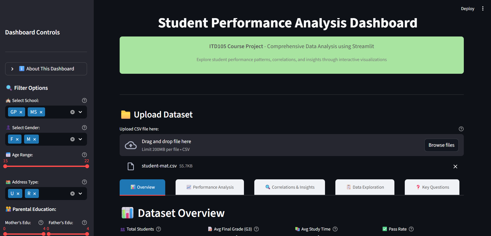

# ITD105 – Student Performance Analysis Dashboard

## Overview

This project is an interactive data analytics dashboard built with **Streamlit** for the ITD105 - Big Data Analytics course. It enables comprehensive exploration and analysis of the [Student Performance Dataset](https://archive.ics.uci.edu/ml/datasets/Student+Performance), focusing on academic outcomes, study habits, demographics, and other factors influencing student success.

## Features

- **Upload Dataset:** Easily upload the student performance CSV file for instant analysis.
- **Interactive Filters:** Filter data by school, gender, age, parental education, study time, failures, absences, and more.
- **Overview:** View key metrics, summary statistics, and a preview of the filtered dataset.
- **Performance Analysis:** Visualize grade distributions, study time impact, absences, and failures.
- **Correlations & Insights:** Explore correlation heatmaps, pair plots, and feature importance for academic performance.
- **Data Exploration:** Analyze distributions, boxplots, violin plots, and categorical feature breakdowns.
- **Key Questions:** Detailed answers to core analytical questions, with visual and statistical support.
- **Recommendations:** Actionable insights and recommendations for educators and students.

## Technologies Used

- **Python 3**
- **Streamlit**
- **Pandas, NumPy**
- **Plotly, Seaborn, Matplotlib**
- **Flaticon UIcons** for enhanced UI

## How to Run

1. **Clone the repository:**
    ```bash
    git clone https://github.com/yourusername/itd105-student-performance-dashboard.git
    cd itd105-student-performance-dashboard
    ```

2. **Install dependencies:**
    ```bash
    pip install streamlit pandas matplotlib seaborn plotly 
    ```

3. **(Optional) Install Flaticon UIcons for local development:**
    ```bash
    npm install @flaticon/flaticon-uicons
    ```

4. **Run the Streamlit app:**
    ```bash
    streamlit run student_performance.py
    ```

5. **Upload the `student-mat.csv` file** (or your dataset) when prompted.

## File Structure

- `student_performance.py` — Main Streamlit dashboard application
- `Answers_to_the_Questions.md` — Detailed answers and analysis for lab questions
- `assets/` — Folder for images/icons (e.g., analysis.png, chart-histogram.svg)
- `.gitignore` — Ignores `node_modules/`, Python cache, and environment files

## Screenshots




## Credits

- **Dashboard by:** Elizabeth R. Refugio
- **Course:** ITD105 - Big Data Analytics
- **Dataset:** [UCI Machine Learning Repository - Student Performance Data Set](https://archive.ics.uci.edu/ml/datasets/Student+Performance)
- **Icons:** [Flaticon UIcons](https://www.flaticon.com/uicons)

## License

&copy; 2025 Elizabeth R. Refugio. All rights reserved.  
For educational use only.

---

**Enjoy exploring student performance analytics!**